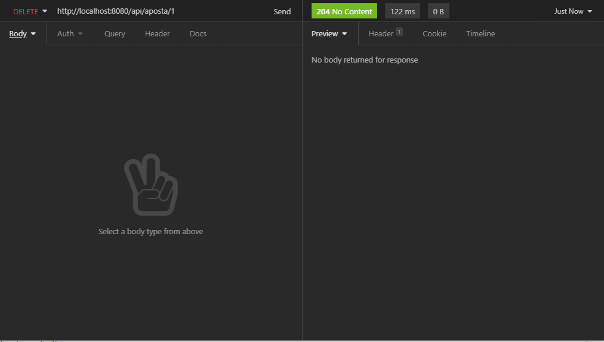

<h2 style="color:orange">Edit: Release 1.1 </h2>

Após o feedback do entrevistador <a href="https://github.com/GuillaumeFalourd">Guillaume </a> foram feitas algumas mudanças já foram incluidas nesse README, dentre elas a possibilidade de alterar o range e a quantidade de números gerados pelo gerador de números pelo banco de dados. 

<h1 style="color:orange;"> Orange talents: </h1>

Esse gerador de apostas foi um projeto proposto pela ZUP para o programa Orange Talents.
Nesse projeto Spring Boot foi desenvolvida uma API REST de sorteios, que recebe como parâmetro um endereço de email e retorna uma lista com seis inteiros que variam entre 1 e 60 (seguindo o modelo da Mega Sena).

<h2 style="color:orange;"> POST: </h2>

- Quando a API recebe uma requisição POST com o caminho `"/api/aposta/"` passando como corpo da requisição um email ela retorna ao usuário o email que foi enviado como parâmetro e os 6 números aleatórios gerados pela aplicação.
- A aplicação faz uma busca no banco de dados e verifica se a aposta gerada é diferente das demais apostas geradas para aquele email antes e fazer a persistência dos dados, se alguma aposta for igual uma nova aposta é gerada e então salva no banco.

  

- Se o email digitado não for válido ele não é persistido e um erro customizado é enviado como resposta à requisição:

<h2 style="color:orange;"> GET: </h2>

A API aceita tres tipos de requisição get:

<h4 style="color:orange;"> "/api/aposta" </h4>

- Quando nenhum parâmetro é passado a API retorna uma lista com todos as apostas de todos os emails.
  

<h4 style="color:orange;"> "/api/aposta/email" </h4>

- Quando o email é passado como parâmetro no corpo da requisição, o retorno é uma lista de todas as apostas referentes ao email do parâmetro.
  

<h4 style="color:orange;"> "/api/aposta/id/${id}" </h4>

- Quando o id é passado como parâmetro na rota `/api/aposta/id/{id}` a API retorna a aposta referente ao id passado como parâmetro.

## DELETE:

- A rota `/api/aposta/{id}` recebe como parâmetro o id da aposta que deve ser deletada.
  

## EXTRA:

- O range e a quantidade de números aleatórios gerados pode ser alterado via banco de dados fazendo um update na tabela params.
  
- Update na tabela para alterar o valor.
  

- Após a alteração dos dados da tabela Params.

  

